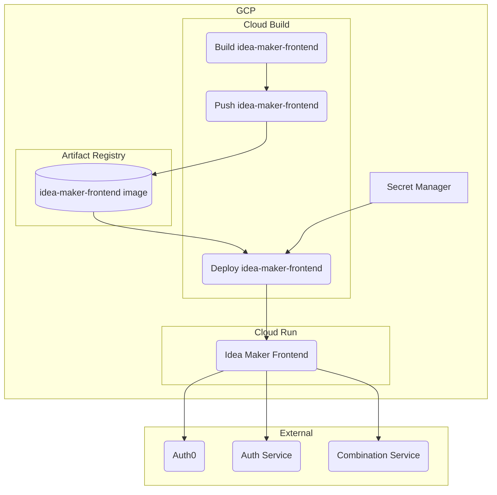

# Idea Maker Frontend

```mermaid
flowchart TD
    subgraph gcp[GCP]
        secret_manager[Secret Manager]

        subgraph cloud_build[Cloud Build]
            build_idea_maker_frontend(Build idea-maker-frontend)
            push_idea_maker_frontend(Push idea-maker-frontend)
            deploy_idea_maker_frontend(Deploy idea-maker-frontend)
        end

        subgraph artifact_registry[Artifact Registry]
            idea_maker_frontend_image[(idea-maker-frontend image)]
        end

        subgraph cloud_run[Cloud Run]
            idea_maker_frontend(Idea Maker Frontend)
        end
    end

    subgraph external[External]
        auth0(Auth0)
        auth_service(Auth Service)
        combination_service(Combination Service)
    end

    build_idea_maker_frontend --> push_idea_maker_frontend --> idea_maker_frontend_image

    idea_maker_frontend_image --> deploy_idea_maker_frontend --> idea_maker_frontend

    secret_manager --> deploy_idea_maker_frontend

    idea_maker_frontend --> auth0
    idea_maker_frontend --> auth_service
    idea_maker_frontend --> combination_service
```
